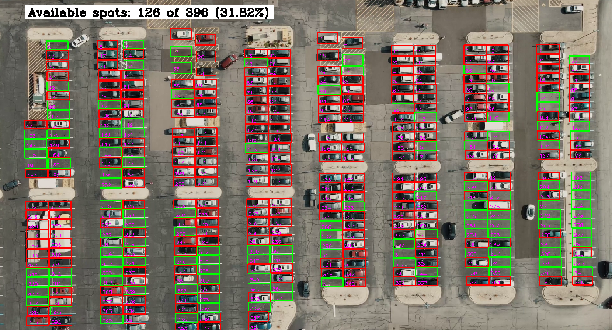

# Parking Lot Monitoring System



## Overview
This project is a parking lot monitoring system designed to detect and monitor the availability of parking spots in a parking lot using computer vision techniques. It provides real-time information about the number of available spots and plots the availability over time.

## Features
- Detects parking spots in a given parking lot using connected components analysis.
- Monitors the occupancy of each parking spot in real-time using computer vision.
- Displays the number of available spots and their percentage over time.
- Provides visualizations of parking spot availability trends.

## Installation

1. Clone the repository:   

2. Install the required dependencies:

    ```bash
    pip install -r requirements.txt
    ```

## Usage

1. Run the main script:

    ```bash
    python run.py
    ```

2. View the real-time visualization of the parking lot occupancy status.

## Configuration

Modify the `config.py` file to adjust settings such as video input path and parking lot layout.


## License

This project is licensed under the MIT License - see the [LICENSE](LICENSE) file for details.
